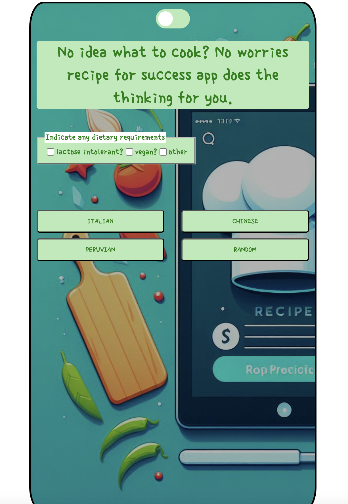

# Recipe For Success

No idea what to cook? No worries! The Recipe For Success app does the thinking for you.

## Table of Contents

- [Description](#description)
- [Features](#features)
- [Technologies Used](#technologies-used)
- [Installation](#installation)
- [Usage](#usage)
- [Screenshots](#screenshots)
- [Contributors](#contributors)
- [Acknowledgements](#acknowledgements)

## Description

Recipe For Success is a web application that generates personalized recipes based on user preferences and dietary restrictions. Utilizing the OpenAI API for text and image generation, this app provides unique recipes complete with AI-generated images.

The application is hosted on Vercel and can be accessed at [Recipe For Success](https://recipe-for-success-iota.vercel.app/).

## Features

- **Cuisine Selection**: Choose from Italian, Chinese, Peruvian, or Random.
- **Dietary Requirements**: Specify if you are lactose intolerant, vegan, or list specific foods you don't eat.
- **Dark/Light Mode**: Toggle between dark and light themes.
- **Loading Indicator**: Displays a loading message while generating your recipe.
- **Recipe Display**: Shows the recipe along with an AI-generated image.
- **Text-to-Speech**: Have the recipe read out loud for accessibility.
- **Email Recipe**: Send the recipe to your email.
- **New Recipe Button**: Easily request another recipe.

## Technologies Used

- **Frontend**: HTML, CSS, JavaScript
- **Backend**: Node.js, Express
- **API**: OpenAI API for text and image generation
- **Accessibility**: Text-to-Speech
- **Other**: Email integration, Dark/Light mode toggle
- **Hosting**: Vercel

## Installation

### Install Dependencies

```sh
npm install dotenv express node nodemailer openai type nodemon


### Setup Environment Variables

Create a `.env` file in the root directory and add your OpenAI API key and other necessary configurations.

### Run the Application

## Usage

Open the application in your browser.
Select your desired cuisine (Italian, Chinese, Peruvian, or Random).
Indicate any dietary requirements (lactose intolerant, vegan, or specify other restrictions).
Click the button and wait for the recipe to be generated.
View the recipe along with an AI-generated image.
Use the text-to-speech feature to hear the recipe.
Email the recipe to yourself or request a new recipe.

## Screenshots

- Home Screen

- Dietary Requirements

- Specify Other Dietary Requirements

- Toggle Dark Mode

- Loading Indicator

- Recipe Result

- Email Recipe


## Contributors

- Sam Hill
- Josue

## Acknowledgements

Thanks to OpenAI for their API.
Inspiration from various cooking apps.
Special thanks to Founders and Coders for providing the basic knowledge to pursue the project.
Special thanks to everyone who helped with the project.
```
